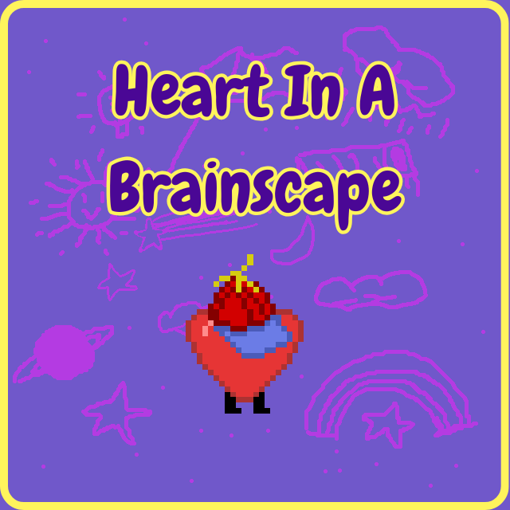

# TransJam2024 : Heart in a Brainscape
🏳️‍⚧️ Dépôt du projet : Heart in a Brainscape pour la TransJam2024

## Contexte
### TransJam 2024
La TransJam2024 a réuni des personnes trans en non-mixité choisie pour créer des jeux vidéo ayant pour but de visibiliser les vécus des personnes trans, dans un contexte où la transidentité dans le jeu vidéo est très peu présente et souvent abordée maladroitement car n'impliquant pas de personnes concernées dans le processus de création.
La Jam s'est déroulée du 09 au 11 novembre 2024 à Paris, France, était organisée par [OUTrans](https://www.outrans.org/), association féministe d'autosupport trans et a rassemblé 16 participant·es.
Pages Itch.io : 
- de la [TransJam2024](https://itch.io/jam/transjam-2024)
- de [Heart in a Brainscape](https://itch.io/jam/transjam-2024/rate/3101495)
  
### Thème
> **Les apparences sont parfois trompeuses**
### Livrables attendus
- Un document de conception (sur itch.io)
- Si possible un prototype

## Notre projet
### Composition de l'équipe
- 4 personnes non professionnelles du jeu vidéo avec des affinités différentes pour la création visuelle, sonore et la programmation.

### Résumé du jeu
Le jeu est une introspection dans la vie mentale de Max, dans lequel son cœur doit explorer son cerveau pour méditer et réfléchir sur pensées conflictuelles et refoulées. La progression se fait en débloquant des zones et en utilisant des compétences différentes conférées par chapeaux ramassés au fil de l'aventure.
### Inspiration
- Vice Versa
- Yume Nikki
- Omori
- Kirby
- EarthBound
- Undertale
- The Legend of Zelda: Four Swords Adventures

### Expérience du joueur·euse
Le-la joueur.euse explore un univers mental avec la possibilité de franchir des obstacles et d’obtenir des chapeaux lui conférant certains pouvoirs pour progresser. 
C’est une expérience immersive qui la-le plonge dans un labyrinthe surréaliste et non-linéaire. Cela pousse le jeu vidéo comme forme d’art dans des retranchements éloignés des jeux les plus populaires, déconstruisant la possibilité narrative d’une exploration environnementale, où les éléments du décor sont figuratifs de référentiels culturels genrés, jusque dans la colorimétrie inspirée du drapeau non-binaire.

### Plateformes
PC (Windows/Linux/MacOS)
	
### Logiciels utilisés
- Godot 4.3
- Aseprite
- Kitra
- LMMS
- Git
- Audacity
- Canva

### Genre
Aventure / puzzle / exploration 

### Informations complémentaires
Retrouvez une description détaillée des mécaniques de jeu et de la direction artistique sur la page itch.io de la transjam2024.
